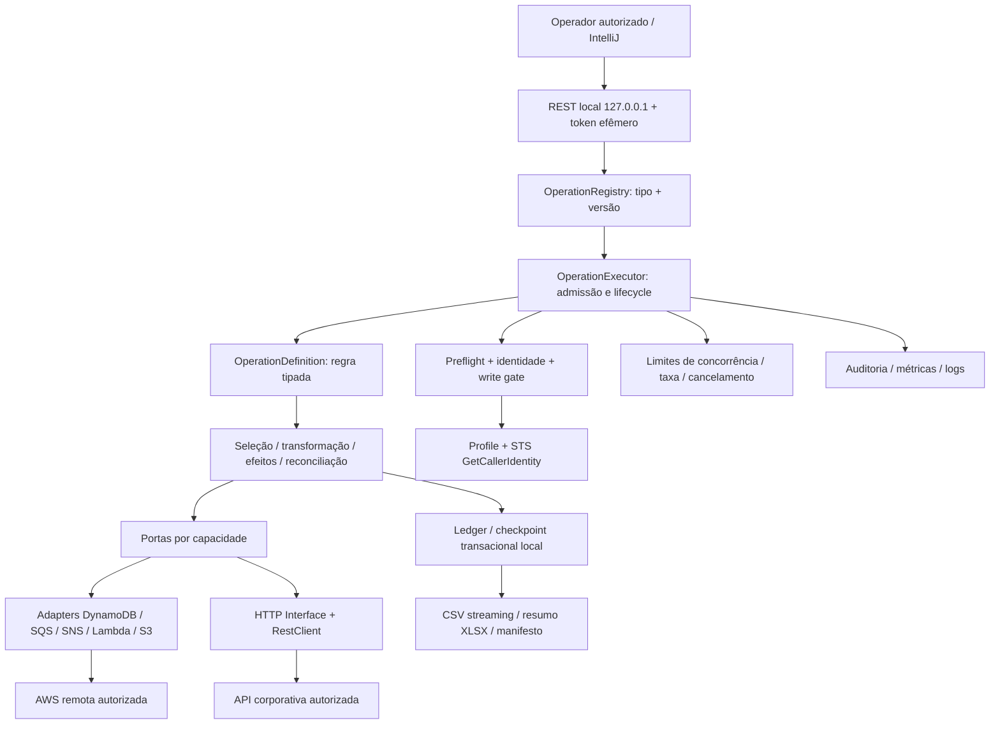
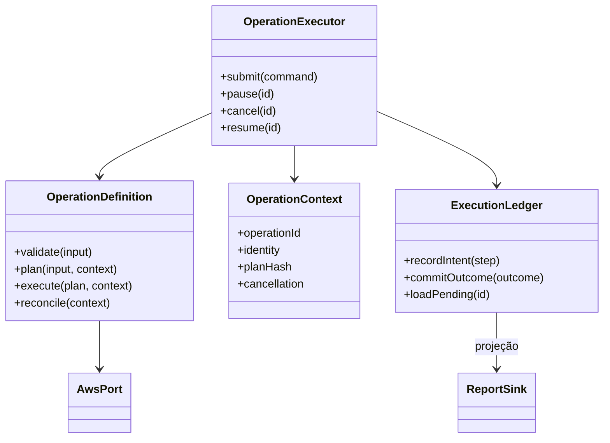

# Arquitetura e blueprint

**DECISÃO — 2026-09-18:** monólito modular local com Ports and Adapters, operações tipadas e engine própria de pequena superfície. A arquitetura abaixo é o produto alvo; o skeleton comprova partes locais e mantém escrita AWS desabilitada.

## Stack e fronteiras

Java 25 sem preview, Spring Boot **4.1.1**, Spring Framework **7.0.9** via BOM, Spring MVC, virtual threads e AWS SDK for Java **2.55.0** síncrono. Boot **3.5.16 / Framework 6.2.19** é alternativa conservadora se já homologada e suportada na organização. A versão corporativa homologada prevalece; sem baseline conhecida, o projeto novo usa 4.1.1 e aceita o custo de homologação de Jackson 3 e da linha Spring 7. As versões são um recorte verificado, não um alias para atualizações automáticas. [Requisitos Boot](https://docs.spring.io/spring-boot/system-requirements.html), [linha 3.5](https://docs.spring.io/spring-boot/3.5/system-requirements.html).

O servidor recebe comandos breves. O trabalho durável pertence à engine, que não depende do tempo de vida da requisição. Regras de incidente conhecem contratos de domínio e portas; clientes AWS e HTTP ficam nos adaptadores. Relatório é uma projeção do resultado registrado, não o mecanismo de controle de execução.



O processo possui acesso remoto, mas não hospeda uma UI compartilhada. Uma configuração não pode misturar clientes de contas/perfis diferentes sob o mesmo contexto. Cache de clientes usa chave imutável `{profile, region, service, policyClass}` e muda apenas entre execuções ou sob pausa/revalidação controlada.

## Padrões escolhidos e limites

| Padrão | Uso concreto | Limite |
|---|---|---|
| Ports and Adapters | Interfaces pequenas para leitura, efeito, relatório, checkpoint, identidade | Sem abstração universal para todas as APIs AWS |
| Command | Request imutável cria um job com intenção e versão | Não serializar classes Java arbitrárias nem aceitar código pela API |
| Strategy | Regra de seleção, transformação e reconciliação por operação | Sem `switch` gigante por incidente |
| Pipeline | Etapas explícitas com resultado tipado e checkpoints | Evitar um DSL novo ou grafo dinâmico sem necessidade |
| Registry | Nome/versão únicos para beans de operações | Duplicatas falham no startup; sem class name vindo da requisição |
| Factory/configuração | Clientes reutilizados com configuração validada | Nunca client por item |
| Template Method | Avaliado, não adotado como hierarquia central | Composição evita subclasses que contornem guardrails |

Spring Batch é uma alternativa legítima se surgirem múltiplos jobs corporativos com metadados, scheduler e suporte institucional. A engine pequena é uma decisão de escopo local, não a afirmação de que recriar um batch framework completo seja vantajoso. Reavaliar antes de implementar distribuição, recuperação multi-host ou um DSL de workflows.

## Modelo de concorrência

| Modelo | Benefício | Custo/risco | Escolha |
|---|---|---|---|
| A: MVC + VT + AWS sync | Fluxo sequencial legível; stacktrace simples; bom ajuste a I/O bloqueante | Precisa de permits, fila e limites de conexão explícitos | Padrão |
| B: MVC + VT + AWS async | Integra transferências/SDK async onde agregam | Dois modelos; `join()` generalizado elimina benefício e complica cancelamento | Exceção medida |
| C: WebFlux + AWS async | Fluxo reativo ponta a ponta e backpressure de demanda | Treinamento, operadores, contexto e risco de bloquear event loop | Não adotado no MVP |
| D: Híbrido por fronteira | S3 async isolado ou CPU em executor próprio | Mais lifecycle e métricas | ADVANCED, somente após benchmark |

**FATO:** virtual threads favorecem tarefas que aguardam I/O e não aceleram trabalho CPU-bound. [Java 25 — virtual threads](https://docs.oracle.com/en/java/javase/25/core/virtual-threads.html). **DECISÃO:** adquirir capacidade antes de submeter novas tarefas; executor de VT não é uma fila limitada. Nenhum `parallelStream()` no hot path operacional. Transformação cara usa pool CPU limitado. `CompletableFuture` fica restrito a integrações async com número de tarefas limitado e executor conhecido.

Semaphore controla simultaneidade; limitador de taxa controla início de chamadas por intervalo; bulkhead isola recursos; orçamento de erro pausa o job. Os mecanismos têm funções distintas. Pool de conexão deve acomodar permits autorizados, não definir implicitamente o teto produtivo. Uma única página lenta aplica backpressure ao produtor; nenhuma coleção reúne todos os registros.

## HTTP e clientes AWS

HTTP Service Interface descreve contratos; `RestClient` executa chamadas síncronas com `JdkClientHttpRequestFactory`, timeout e handlers de erro. `WebClient` é reservado para streaming assíncrono com justificativa. OpenFeign não é escolhido: o próprio Spring o considera feature-complete e recomenda avaliar HTTP Service Clients; não há `ErrorDecoder` Feign a implementar. [Spring HTTP clients](https://docs.spring.io/spring-framework/reference/integration/rest-clients.html), [OpenFeign](https://docs.spring.io/spring-cloud-openfeign/reference/).

AWS usa transporte `Apache5HttpClient` explícito, evitando que mudança de defaults altere o desenho. Netty atende async; CRT pode ser útil em transferências após validar bibliotecas nativas, proxy/TLS e medição; `UrlConnectionHttpClient` serve cenários reduzidos. O JDK HTTP de RestClient não deve ser confundido com um transporte do SDK AWS escolhido automaticamente. [Transportes SDK](https://docs.aws.amazon.com/sdk-for-java/latest/developer-guide/http-configuration.html), [Apache 5](https://docs.aws.amazon.com/sdk-for-java/latest/developer-guide/http-configuration-apache5.html).

## Organização recomendada

Árvore alvo por capacidade, com dependências dirigidas ao core. Alguns pacotes/classes pertencem ao roadmap, não ao skeleton:

```text
<base-package>/
  AwsOpsToolkitApplication
  configuration/       ToolkitProperties, AwsClientConfiguration, LocalSecurityConfiguration
  operation/
    api/                OperationController, OperationRequest, OperationView
    core/               OperationDefinition, OperationExecutor, OperationRegistry
                        OperationContext, OperationStateMachine, CancellationToken
                        OperationPlan, OperationProgress, OperationResult
    demo/               SyntheticOperation
    payments/           ReconcilePaymentsOperation, PaymentRule
  preflight/            PreflightCheckService, WriteAuthorizationGate, TargetPolicy
  aws/
    auth/               CredentialHealthService, IdentitySnapshot
    dynamodb/           DynamoReadPort, DynamoWritePort, DynamoDbAdapter, ScanCoordinator
    sqs/                SqsInspectionPort, SqsDeliveryPort, SqsAdapter
    sns/                EventPublisherPort, SnsAdapter
    lambda/             FunctionInvocationPort, LambdaAdapter
    s3/                 EvidenceStoragePort, S3Adapter
  http/                 EnrichmentPort, EnrichmentHttpClient, HttpFailureClassifier
  resilience/           FailureClassifier, RetryBudget, ConcurrencyController, RateController
  checkpoint/           CheckpointStore, JsonCheckpointStore, SqliteExecutionLedger
  report/               ReportSink, CsvReportWriter, XlsxSummaryWriter, ReportManifest
  audit/                AuditSink, AuditEvent
  observability/        OperationMetrics, CorrelationContext
```

## Matriz de responsabilidades

| Contrato/componente | Entrada → saída | Dependências permitidas |
|---|---|---|
| `OperationDefinition<I,R>` | Request tipado → plano e resultado | Portas e regras puras |
| `OperationRegistry` | Nome/versão → definição | Coleção validada de definições |
| `OperationExecutor` | Comando → execução durável | Registry, preflight, store, controle e sinks |
| `OperationContext` | Metadados imutáveis + controles | Identidade sanitizada, plano, cancelamento, orçamento |
| `OperationStateMachine` | Estado + evento + revisão → novo estado | Tabela de transições e store com CAS |
| `CredentialHealthService` | Provider/profile → identidade/status | STS e provider; nenhum secret na saída |
| `WriteAuthorizationGate` | Plano + identidade + aprovação → permit de efeito | Política tipada, relógio, audit |
| `DynamoDbAdapter` | Pedido tipado → página ou resultado individual | Client compartilhado e classifier |
| `ScanCoordinator` | Plano imutável de segmentos → páginas limitadas | Cursores por segmento, rate/concurrency |
| `ExecutionLedger` | Intenção/transição/resultado → commit local | SQLite alvo, single writer, migração de schema |
| `ReportSink` | Evento confirmado → projeção streaming | Writer e manifesto; não libera checkpoint sozinho |
| `FailureClassifier` | Exceção sanitizada → categoria/ação | Mapeamento AWS/HTTP sem retry implícito |
| `AuditSink` | Evento relevante → evidência | Buffer limitado; falha bloqueia escrita quando obrigatório |



## Contexto e imutabilidade

Usar records pequenos para request, identidade, plano e resultado. Contexto não carrega credenciais, clients mutáveis ou a lista de itens. `ScopedValue` é estável no Java 25 e pode carregar correlação imutável, mas binding é por thread: tasks submetidas a executors precisam de rebind explícito. O fluxo principal mantém parâmetros explícitos; MDC recebe campos sanitizados no limite de cada tarefa. [API ScopedValue](https://docs.oracle.com/en/java/javase/25/docs/api/java.base/java/lang/ScopedValue.html).

Structured Concurrency permanece preview no Java 25; o projeto não o usa. [Oracle — Structured Concurrency](https://docs.oracle.com/en/java/javase/25/core/structured-concurrency.html). Uma otimização não pode tornar impossível compilar ou executar sem preview.

## Contrato de prontidão

Antes de qualquer war room devem estar homologados clients reutilizados, credenciais, preflight, classificação de erros, controle de fluxo, ledger, relatório, auditoria e cancelamento. A regra nova pode alterar seleção/transformação, mas não remover barreiras. Extensão que introduza novo efeito ou endpoint requer nova política de idempotência e validação de contrato.
