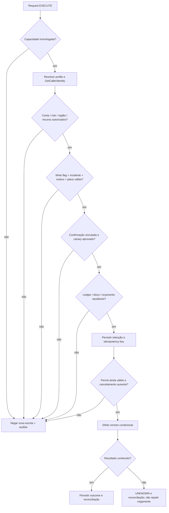

# Segurança e proteções de produção

**DECISÃO — 2026-09-18:** em dúvida, não emitir novo efeito remoto. O skeleton não oferece execução produtiva de escrita; os controles abaixo são requisitos para a fase CORE, além das políticas corporativas. Nenhum campo da requisição substitui autorização AWS.

## Modelo de ameaça e fronteiras

Os riscos principais são conta/recurso incorretos, privilégio residual no ambiente, regra emergencial errada, repetição após timeout, páginas parcialmente processadas, acesso ao servidor local por outra aplicação, fuga de dados em relatório e perda de evidência por disco cheio. O toolkit não é uma sandbox contra código Java malicioso executado pelo próprio usuário; IAM, controles do endpoint corporativo, revisão e auditoria continuam essenciais.

**FATO:** `GetCallerIdentity` retorna conta e identidade da credencial efetiva, mas não comprova permissão para escrever no recurso. [STS GetCallerIdentity](https://docs.aws.amazon.com/STS/latest/APIReference/API_GetCallerIdentity.html). **DECISÃO:** chamar STS com o mesmo provider selecionado e região explicitamente configurada dos clientes operacionais. Nunca inferir ambiente apenas do nome de profile ou tabela.

## Condições cumulativas de escrita

| Barreira | Condição | Se falhar |
|---|---|---|
| Capacidade implementada | Operação declarada WRITE e implementação homologada | Rejeitar; skeleton sempre bloqueia |
| Credencial legítima | Provider resolve, STS responde e sessão ainda autorizada | AUTHENTICATION_REQUIRED ou pausa |
| Identidade | Account + partition + role autorizada; session ARN auditado | Bloquear antes da primeira chamada |
| Ambiente | Mapeamento administrado conta/recurso → DEV/HML/PROD | Rejeitar configuração ambígua |
| Alvo | ARN/nome canônico permitido, região/owner conferidos | Bloquear, inclusive alias redirecionado |
| Configuração | `writeEnabled=true` explícito no processo autorizado | Negar por padrão |
| Intenção | `mode=EXECUTE`, incidente/change e motivo válidos | Validar com erro claro |
| Plano | Dry-run associado, versão/hash e TTL válidos | Exigir novo plano |
| Confirmação | Ato explícito vinculado ao plano, alvos e volume | Não aceitar somente um booleano genérico |
| Escala | Canary aprovado, teto `maxItems` e taxa/concorrência | Parar no limite, registrar truncamento |
| Evidência | Ledger, auditoria e reserva de disco saudáveis | Fechar admissão de efeitos |
| AWS | IAM/SCP/resource policy/KMS autorizam a chamada | AccessDenied pausa; sem elevação automática |

`PROD` exige todas as barreiras. DEV/HML também têm defaults sem escrita, alvos explícitos e idempotência; apenas os procedimentos corporativos podem distinguir aprovações por ambiente. **VALIDAR NO AMBIENTE / ITAÚ:** quem aprova, se há duas pessoas, formato de incidente/change, duração e evidência do Break Glass. O toolkit não inventa essas regras.

## Plano e confirmação

Um dry-run produz plano versionado, contendo parâmetros canônicos, account/role/região, recursos, estratégia de seleção, hash da regra/build, volume esperado ou desconhecido, teto de itens, colunas exportadas, estimativa de chamadas e risco. A confirmação registra `planId`, `planHash`, operador, incidente, horário e validade. Uma alteração em regra, alvo, versão ou teto invalida a confirmação.

O plano não congela dados vivos. EXECUTE repete condições de elegibilidade e compara versões antes de cada alteração. Diferença acima do limite aprovado pausa e pede novo dry-run. Candidatos muito grandes ficam em manifesto/ledger no disco, nunca em um objeto gigante na heap. Usar hash do payload canônico para vincular intenção; não usar hash de credenciais ou payload sensível em logs.

O permit de escrita tem validade curta e pertence à identidade/plano. Toda admissão verifica cancelamento, pausa, saúde de autenticação e permit. Em renovação, aceitar apenas account/role previstos; nova sessão da mesma role pode ser válida após revalidação, mas deve ficar registrada. Não há STS por item: cache de saúde tem TTL limitado e é invalidado imediatamente por falha de autenticação. Isso reduz a janela de exposição sem prometer prevenção instantânea de qualquer mudança externa.

## Preflight automatizado

| Verificação | Evidência | Observação |
|---|---|---|
| Configuração | Properties validadas; limites positivos e consistentes | Sem default silencioso de PROD |
| Identidade | STS account/ARN sanitizados, profile escolhido | Sem armazenar secret/token |
| Região e recurso | Describe/GetAttributes/Head quando aplicável | Recurso existente não significa autorizado para toda ação |
| Permissão mínima | Chamada de leitura segura e manifesto IAM esperado | Não testar escrita real para provar permissão; simulação IAM é auxiliar, não garantia |
| Conectividade | DNS, proxy, TLS e timeout de chamada permitida | Não desativar verificação TLS |
| Disco | Diretório privado, escrita/flush de prova, espaço livre/reserva | Diretório do ledger também conta |
| Plano | Volume, `maxItems`, quantidade de segmentos fixa e hash | Estimativa desconhecida exige teto conservador |
| Efeito | Política de idempotência e reconciliação presente | Sem política, operação rejeitada |
| Auditoria | Sink disponível e retenção definida | Sem trilha obrigatória, sem escrita |

Ao pausar por falta de espaço, a reserva emergencial de checkpoint deve permitir registrar o motivo e os efeitos pendentes. A aplicação não pode prometer gravar depois de o filesystem já ficar indisponível; a última intenção durável torna os efeitos não confirmados recuperáveis como UNKNOWN.

## API e workstation

Bind em `127.0.0.1`; autenticação com token efêmero por inicialização, entregue por mecanismo local protegido e nunca em URL. Se for preciso persistir o token para o operador, usar arquivo com ACL restrita, fora do Git e remover no shutdown. Não registrar token nos logs de requisição. CORS não habilitado por padrão; validar Host/Origin quando aplicável. Com bearer stateless em header, avaliar configuração de CSRF especificamente; se introduzir cookie/sessão/browser, não copiar indiscriminadamente a configuração anterior.

Actuator expõe somente health necessário; env/configprops/heapdump não ficam disponíveis sem proteção adicional. Swagger pode ficar restrito ao ambiente local e à autenticação; payloads de exemplo são sintéticos. Tamanho máximo de request, paginação de erros, admission control e número máximo de jobs limitam abuso acidental. Report IDs resolvem a artefatos conhecidos; jamais permitir caminhos arbitrários ou path traversal.

## Dados, retenção e rollback

Extrair somente os atributos necessários; mascarar identificadores, controlar colunas e separar pre-images sensíveis dos relatórios resumidos. Hash simples de identificadores previsíveis não equivale a anonimização: preferir HMAC com chave gerida externamente se a correlação pseudonimizada for exigida. Retenção, criptografia de disco e destino de evidências são **VALIDAR NO AMBIENTE / ITAÚ**.

Pre-image não autoriza restauração cega. Rollback deve ser outra operação com dry-run, condição sobre versão/estado pós-correção e verificação de efeitos externos. Se outro sistema modificou o item, registrar conflito. SNS, SQS e invocação de Lambda não possuem desfazer universal; compensação exige semântica de negócio e aprovação.

## Antipadrões que bloqueiam liberação

- Ignorar erro de auditoria/ledger e seguir escrevendo; registrar sucesso antes de resposta ou reconciliação.
- Confundir `writeEnabled` ou profile chamado `prod` com autorização corporativa.
- Aceitar SQL/expressões DynamoDB/URLs livres vindos do request sem schema e allowlist.
- Atualizar item inteiro quando alteração parcial condicional atende; rollback sem comparação de versão.
- Fazer retry de efeito incerto sem chave de idempotência nem consulta de resultado.
- Exportar dados completos, credenciais, headers Authorization, tokens SSO ou stdout do credential_process.
- Apagar trilhas, liberar firewall público para o servidor local ou desativar TLS para contornar proxy.
- Considerar lock local suficiente para impedir outro operador em outra máquina de alterar os mesmos itens.

Essas barreiras complementam as [boas práticas de privilégio mínimo e acesso temporário IAM](https://docs.aws.amazon.com/IAM/latest/UserGuide/best-practices.html); não modificam políticas ou concedem acesso.
