# Operation Engine, lifecycle e API

**DECISÃO — 2026-09-18:** a engine controla infraestrutura, limites e durabilidade; a operação fornece a regra tipada. A API não segura uma conexão durante varreduras extensas. O comportamento alvo abaixo amplia deliberadamente a implementação demonstrativa.

## O que o skeleton prova

Pacote base real: `io.github.awsopstoolkit`. O contrato compilável `OperationDefinition<I>` possui `type()`, `inputType()`, `total(I)` e `execute(I, OperationContext)`. `SyntheticInventoryOperation` gera registros sintéticos paginados. O contexto contém ID, cursor inicial, page size, cancelamento cooperativo e callback de commit; não possui clients AWS. A entrada comum contém `mode` e `parameters`, convertido para o tipo registrado.

Estados reais do enum demonstrativo: `CREATED`, `RUNNING`, `PAUSING`, `PAUSED`, `CANCELLING`, `CANCELLED`, `INTERRUPTED`, `COMPLETED`, `FAILED`. Apenas `PAUSED` e `INTERRUPTED` admitem resume. `AUTHENTICATION_REQUIRED`, ledger por efeito e fluxo produtivo de aprovação pertencem ao alvo. Referência do código: [OperationDefinition](../src/main/java/io/github/awsopstoolkit/operation/OperationDefinition.java) e [OperationStatus](../src/main/java/io/github/awsopstoolkit/operation/OperationStatus.java).

## Contratos alvo

| Contrato | Responsabilidade | Invariante |
|---|---|---|
| `OperationDefinition<I,R>` | Validar, construir plano, selecionar/transformar e reconciliar regra | Não cria threads, credentials providers, clients ou retries próprios |
| `OperationPlan` | Versão, input canônico, alvos, estratégia, limites e hash | Imutável após aprovação |
| `OperationContext` | ID, identidade sanitizada, plano, controles e portas | Não transporta secrets nem grande coleção de resultados |
| `OperationResult<R>` | Resumo e referências aos artefatos | Não é `List` com milhões de itens |
| `OperationProgress` | Contadores `long`, cursores, taxas e estimativa | Distingue examinado/candidato/confirmado/ignorado/falho/incerto |
| `OperationCheckpoint` | Fronteiras de recuperação e versão do schema | Só cobre trabalho duravelmente contabilizado |
| `OperationReport` | Manifesto, hashes, partes e schema de colunas | Parcial identificado explicitamente |
| `OperationRegistry` | Resolver nome e versão de implementação | Tipos e versões duplicados falham no startup |
| `OperationCancellationToken` | Sinalização cooperativa de pause/cancel/shutdown | Cancel não significa rollback |

Os contratos são um blueprint, não uma exigência de criar todas as interfaces antes de haver uma implementação útil. Adicionar abstração quando isola uma decisão real de segurança ou integração.

## Pipeline e propriedade dos efeitos

1. **Admitir:** validar forma, resolver operação, deduplicar chave do comando, reservar vaga e gravar CREATED antes de retornar 202.
2. **Validar:** schema de entrada, preflight, identidade, recursos e budgets; nenhuma escrita de negócio nessa etapa.
3. **Planejar:** selecionar estratégia Get/Query/Scan, número fixo de segmentos, colunas, quantidade máxima e etapas com side effects.
4. **Selecionar/transformar:** funções compartilhadas por DRY_RUN e EXECUTE, com entradas versionadas e saída `ProposedChange`.
5. **Executar:** DRY_RUN grava proposta; EXECUTE passa pelo write gate, persiste intenção, faz efeito, confirma outcome e reconcilia incertezas.
6. **Concluir:** reconciliação, fechamento dos sinks, manifesto e estado final em commit durável.

Dry-run pode consumir capacidade de leitura e chamar APIs GET de enriquecimento, portanto também usa limites, timeouts e autorização. Não enviar SNS/SQS, invocar Lambda de negócio nem subir relatório para S3 como efeito oculto do dry-run. Exportação remota é operação separada e explicitamente autorizada.

## Máquina de estados alvo

```mermaid
stateDiagram-v2
    [*] --> CREATED
    CREATED --> VALIDATING
    VALIDATING --> READY: preflight válido
    VALIDATING --> AUTHENTICATION_REQUIRED: autenticação indisponível
    VALIDATING --> FAILED: request ou configuração inválida
    READY --> DRY_RUNNING: modo DRY_RUN
    READY --> RUNNING: modo EXECUTE e write gate aprovado
    DRY_RUNNING --> PAUSING: pause ou condição de segurança
    RUNNING --> PAUSING: pause, auth, budget ou disco
    PAUSING --> PAUSED: dreno seguro; motivo operacional
    PAUSING --> AUTHENTICATION_REQUIRED: dreno seguro; motivo autenticação
    PAUSING --> RECOVERY_REQUIRED: efeitos incertos
    DRY_RUNNING --> CANCELLING: cancelar
    RUNNING --> CANCELLING: cancelar
    CANCELLING --> CANCELLED: pendências contabilizadas
    CANCELLING --> RECOVERY_REQUIRED: efeitos incertos
    DRY_RUNNING --> COMPLETED: relatório confirmado
    RUNNING --> RECONCILING: seleção finalizada
    RECONCILING --> COMPLETED: nenhum erro ou pendência
    RECONCILING --> COMPLETED_WITH_ERRORS: erros conhecidos sem pendência
    RECONCILING --> RECOVERY_REQUIRED: resultado ainda incerto
    PAUSED --> VALIDATING: resume autorizado
    AUTHENTICATION_REQUIRED --> VALIDATING: credencial renovada e resume
    INTERRUPTED --> VALIDATING: recuperação explícita
    RECOVERY_REQUIRED --> VALIDATING: revisão e plano de recuperação
    RUNNING --> INTERRUPTED: detecção no próximo startup
    DRY_RUNNING --> INTERRUPTED: detecção no próximo startup
    RECONCILING --> INTERRUPTED: detecção no próximo startup
    COMPLETED --> [*]
    COMPLETED_WITH_ERRORS --> [*]
    CANCELLED --> [*]
    FAILED --> [*]
```



O diagrama destaca o caminho normal e as falhas principais. A tabela abaixo fecha os casos administrativos e de persistência:

| Origem | Evento | Destino permitido | Condição |
|---|---|---|---|
| CREATED/VALIDATING/READY | Cancel antes de efeitos | CANCELLED | Persistir decisão e liberar vaga |
| READY | Pause | PAUSED | Sem trabalho em voo |
| PAUSED/AUTHENTICATION_REQUIRED | Cancel | CANCELLED | Nenhum UNKNOWN pendente; caso contrário RECOVERY_REQUIRED |
| Qualquer estado ativo | Erro fatal conhecido | FAILED | Drenar e contabilizar todo efeito antes; UNKNOWN exige RECOVERY_REQUIRED |
| Qualquer estado ativo persistido no restart | Processo anterior não executa | INTERRUPTED | Lock exclusivo obtido; preservar ledger e motivo anterior |
| RECONCILING | Pause/cancel | PAUSING/CANCELLING | Reconciliação pendente fica registrada; nunca apagar a fila |
| INTERRUPTED/RECOVERY_REQUIRED | Resume/recovery | VALIDATING | Reconciliação precede novos efeitos; revalidar plano/identidade |
| Estado terminal | Resume | Nenhum | HTTP 409; nova execução com vínculo explícito se necessária |

As transições usam revisão/CAS no armazenamento e são serializadas por job. Um pedido de cancelamento não pode ser sobrescrito por worker atrasado marcando COMPLETED. Todos os eventos de lifecycle são auditados; transição não permitida retorna erro estável sem modificar dados.

`COMPLETED_WITH_ERRORS` significa que todos os resultados são conhecidos, inclusive falhas identificadas. **Não** pode conter UNKNOWN. `FAILED` não significa ausência de alterações anteriores. `CANCELLED` encerra admissão e execução futura; pode haver mudanças confirmadas e relatório parcial. Estados finais carregam contadores e motivo, não apenas um nome.

## API alvo

| Método e caminho | Contrato | Resposta normal |
|---|---|---|
| `POST /api/v1/operations/{type}` | Iniciar DRY_RUN ou EXECUTE com body tipado e `Idempotency-Key` | 202, ID e Location após persistir admissão |
| `GET /api/v1/operations/{id}` | Estado, modo, metadados, contadores e links | 200 |
| `GET /api/v1/operations/{id}/progress` | Taxas, segmentos concluídos, ETA opcional | 200 |
| `POST /api/v1/operations/{id}/pause` | Solicitar pausa cooperativa | 202 ou 200 se já pausado |
| `POST /api/v1/operations/{id}/cancel` | Cancelamento idempotente | 202 ou 200 se já cancelado |
| `POST /api/v1/operations/{id}/resume` | Preflight + recuperação; revisão esperada | 202 ou 409 |
| `GET /api/v1/operations/{id}/errors?cursor=...&limit=...` | Erros sanitizados com paginação | 200 |
| `GET /api/v1/operations/{id}/reports` | Manifesto e artefatos conhecidos | 200 |
| `GET /api/v1/operations/{id}/reports/{artifactId}` | Download streaming, caminho nunca arbitrário | 200/206 quando suportado |
| `POST /api/v1/plans/{id}/confirm` | Confirmação explícita vinculada ao plano | 200; não escreve AWS |

Esses endpoints adicionais são **blueprint**; conferir o controller e README para a API efetivamente implementada. Não instalar uma API que aceite produção apenas porque o contrato está documentado.

Exemplo de body alvo, com valores fictícios:

```json
{
  "mode": "EXECUTE",
  "incidentId": "INC-EXEMPLO",
  "changeId": "CHG-EXEMPLO",
  "reason": "Reconciliar estados após falha demonstrativa",
  "planId": "<DRY_RUN_PLAN_ID>",
  "planHash": "<APPROVED_PLAN_HASH>",
  "parameters": {
    "resourceAlias": "payments-hml",
    "maxItems": 100,
    "expectedState": "PENDING_RECONCILIATION"
  }
}
```

O `resourceAlias` resolve allowlist local; não aceita ARN arbitrário do caller. Tipo de `parameters` é determinado pelo registry e validado. Campos desconhecidos são rejeitados para evitar configuração digitada incorretamente. Não desserializar tipos polimórficos arbitrários.

Chave idempotente de início é persistida junto ao hash canônico da requisição: mesma chave/body retorna o mesmo ID; mesma chave/body diferente retorna 409. Não há obrigação de usar uma transação distribuída para devolver HTTP; se a resposta 202 se perder, repetir a chave recupera o job criado.

Erros seguem corpo padronizado com categoria, ID de correlação e detalhe sanitizado: 400 formato, 401 token local, 403 política, 404 recurso local desconhecido, 409 estado/plano incompatível, 422 semântica, 429 capacidade local esgotada, 503 infraestrutura indisponível. Nenhum erro devolve stacktrace com segredos.

## Limites, cancelamento e shutdown

Um orçamento global limita jobs admitidos; outro limita downstream. Um job aguarda capacidade antes de materializar a próxima página. Limitar tamanho em bytes além do número de itens. Progress updates são agregados e não abrem uma transação por caractere/linha de CSV.

Pause/cancel fecham aquisição de novas páginas e novos efeitos. Chamadas já enviadas podem concluir; registrar resposta ou UNKNOWN. Aguardar até deadline configurado, fazer flush e persistir. Interrupt é último mecanismo cooperativo para desbloquear espera local; não assegura cancelamento remoto. Nunca assumir que abortar uma request HTTP desfez escrita no servidor.

Shutdown coordenado usa lifecycle Spring: bloquear nova admissão, solicitar pausa, aguardar prazo, fechar writers e clients. **Stop/kill abrupto do IntelliJ pode impedir hooks**; o restart deve recuperar pelo último estado durável, não pela promessa de que um hook sempre roda. O processo não retoma automaticamente escrita ao abrir o projeto.

## Adicionar uma operação

Criar record de parâmetros com validação, definir tipo/versão únicos, implementar seleção/transformação pura e portas necessárias, declarar se há efeitos e respectiva estratégia de idempotência/reconciliação. Registrar no registry por bean. Validar dry-run sintético, casos de conflito, classificação de falhas e canary DEV/HML. Se exigir alterar a engine para executar a regra, revisar se a extensão realmente é reutilizável ou está misturando domínio com infraestrutura.
