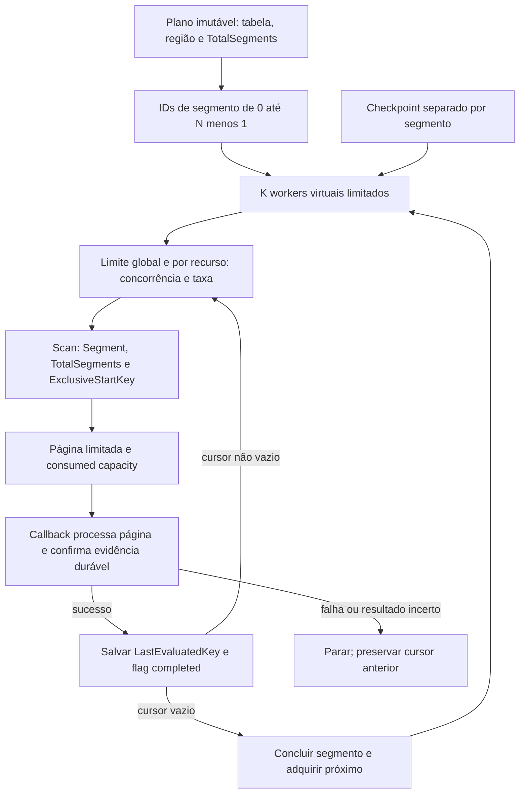

# DynamoDB: acesso híbrido, varredura limitada e correções recuperáveis

Projeto: **aws-ops-toolkit**. Pesquisa oficial consultada em **18/09/2026**. Os limites abaixo são os documentados nessa data; conferir quotas, IAM e capacidade do recurso antes de executar.

## 1. Decisão e escopo entregue

Adotar AWS SDK for Java 2.x com dois caminhos: API de baixo nível para investigação dinâmica e Enhanced Client para domínios estáveis. A operação conhece a regra do incidente; o adapter conhece requests, paginação e respostas AWS. Não criar uma entidade para cada tabela investigada.

O código de referência em `src/main/java/io/github/awsopstoolkit/aws/DynamoDbService.java` implementa Get, BatchGet, Query paginada, Scan segmentado com workers virtuais limitados, callbacks de checkpoint, Put/Update/Delete condicionais, BatchWrite e TransactWrite. Recebe clients reutilizados e autorização por construtor; não se registra automaticamente no Spring e não habilita escrita. `DynamoDocument` é uma visão mínima sobre atributos dinâmicos, com números em `BigDecimal` e distinção entre ausência e `NULL`.

Persistência de checkpoints, autorização corporativa, reconciliação de escritas, pre/post-images, AIMD e integração dessas rotinas com operações HTTP são **arquitetura alvo**. A existência de um método SDK não significa que exista uma operação de produção homologada. Os callbacks do Scan devem ser thread-safe e fornecer persistência durável antes de devolver o controle.

## 2. Escolha da API por semântica

| Necessidade | API | Decisão operacional |
|---|---|---|
| Uma chave conhecida | `GetItem` | Preferência para confirmação pontual; selecionar atributos necessários |
| Conjunto de chaves conhecidas | `BatchGetItem` | Lotes de até 100 chaves e até 16 MB de resposta; manter `UnprocessedKeys` |
| Partition key conhecida e intervalo na sort key | `Query` | Condição de chave e paginação explícitas |
| Padrão atendido por índice existente | `Query` + `IndexName` | Conferir projeção, disponibilidade e consistência do índice |
| Predicado sem acesso por chave/índice | `Scan` | Exceção explícita com orçamento, janela e impacto aprovado |
| Criar item completo | `PutItem` condicional | Preferir `attribute_not_exists` para criação; Put sem condição pode substituir o item |
| Alterar poucos atributos | `UpdateItem` condicional | `SET`/`REMOVE` com versão ou valor esperado |
| Excluir item específico | `DeleteItem` condicional | Verificar versão/precondição e política de pre-image |
| Muitos puts/deletes independentes | `BatchWriteItem` | Até 25 operações; sem update ou condição por item |
| Invariantes entre itens | `TransactWriteItems` | Atomicidade limitada ao conjunto; token estável e custo justificado |

A preferência de seleção é **Get/BatchGet/Query/índice antes de Scan**, sem impedir o Scan necessário numa emergência. Query exige igualdade na partition key; a sort key pode restringir a faixa. Um filtro pós-leitura não substitui essa condição. [Condições de Query](https://docs.aws.amazon.com/amazondynamodb/latest/developerguide/Query.KeyConditionExpressions.html)

`BatchGetItem` pode retornar parte das chaves por tamanho, throughput ou outros limites. A ordem da resposta não corresponde necessariamente à entrada: incluir as chaves na projeção e correlacionar por chave, nunca por posição. A ausência de um item e uma chave não processada são resultados diferentes. [BatchGetItem](https://docs.aws.amazon.com/amazondynamodb/latest/APIReference/API_BatchGetItem.html)

## 3. Typed Mode e Schemaless Mode

| Critério | Enhanced Client tipado | Map/Enhanced Document API |
|---|---|---|
| Tabela estável e conhecida | Excelente: schema explícito e converters revisados | Possível, mas perde parte da verificação estática |
| Tabela desconhecida em incidente | Preparação de modelo pode atrasar a análise | Preferência para leitura, seleção e relatório |
| Campos opcionais/heterogêneos | Converters e política de nulidade explícitos | Verificar tipo por atributo e tratar ausência |
| Escrita de produção | Update mínimo com condições | Mesmas condições, mais validação dinâmica |
| Evolução de schema | Revisão de compatibilidade e testes de mapeamento | Preservar atributos desconhecidos; nunca fazer round-trip destrutivo |

O Enhanced Client suporta schemas estáticos e objetos mapeados; a **Enhanced Document API existe no SDK 2.x**, com `EnhancedDocument` e `DocumentTableSchema`. Não importar a antiga Document API do SDK 1.x. Para tabelas dinâmicas, o Document schema ainda precisa representar as chaves/índices relevantes. [Enhanced Client](https://docs.aws.amazon.com/sdk-for-java/latest/developer-guide/ddb-en-client-use.html), [Enhanced Document API](https://docs.aws.amazon.com/sdk-for-java/latest/developer-guide/ddb-en-client-doc-api.html)

Usar `Map<String, AttributeValue>` no adapter inicial evita conversões globais e mantém `S`, `N`, `BOOL`, `NULL`, `M`, `L`, binários e sets. Não converter tudo a `String`, `double` ou JSON sem schema: precisão numérica, distinção entre lista/set e binário podem se perder. O `DynamoDocument` entregue oferece apenas acesso a string, número, valor bruto e nulidade; extração de caminhos e converters adicionais serão funções pequenas, específicas da operação.

Exemplo com as classes entregues; `tableArn`, `pk`, `client`, `gate` e `authorization` são entradas já validadas:

```java
var service = new DynamoDbService(client, gate, authorization, 100);
var response = service.get(GetItemRequest.builder()
        .tableName(tableArn)
        .key(Map.of("pk", AttributeValue.fromS(pk)))
        .projectionExpression("#pk, #s, #v")
        .expressionAttributeNames(Map.of("#pk", "pk", "#s", "status", "#v", "version"))
        .consistentRead(true)
        .build());
if (response.hasItem()) {
    var document = new DynamoDocument(response.item());
    var version = document.number("version"); // Optional<BigDecimal>; tipo incorreto é erro
}
```

## 4. Query, paginação e Scan

Uma página de Scan avalia até o `Limit` configurado ou até 1 MB antes de filtrar. `ScannedCount` mede examinados e `Count` mede retornados naquela página; acumular ambos. Filtros e projeções reduzem dados transferidos/processados, mas não são desconto automático de capacidade de leitura. Página vazia pode carregar cursor: terminar apenas quando `LastEvaluatedKey` estiver ausente/vazio. [Scan e capacidade](https://docs.aws.amazon.com/amazondynamodb/latest/developerguide/Scan.html)

O cursor da resposta vira `ExclusiveStartKey` na próxima chamada. No Scan paralelo, reutilizar esse cursor com o mesmo `Segment`; `TotalSegments` faz parte do plano da execução. `ConsistentRead=true` não transforma uma varredura longa em snapshot transacional. Escritas concorrentes exigem condições no momento de corrigir cada item. [Contrato de Scan](https://docs.aws.amazon.com/amazondynamodb/latest/APIReference/API_Scan.html)

Leitura eventual é suficiente para investigação aproximada; leitura forte pode justificar-se para reconciliação pontual antes/depois de uma escrita. GSI não oferece leitura fortemente consistente; tabela e LSI podem oferecer. Ler novamente na tabela base não torna o conjunto inteiro da operação um snapshot. [Modelos de consistência](https://docs.aws.amazon.com/amazondynamodb/latest/developerguide/HowItWorks.ReadConsistency.html)

Paginators do SDK são úteis para iteração lazy, mas não substituem orçamento, checkpoint e idempotência. No exemplo entregue, o loop é explícito para tornar visível a ordem de confirmação da página. Não usar `scanPaginator(...).items().stream().toList()` para milhões de itens. [Paginação SDK 2.x](https://docs.aws.amazon.com/sdk-for-java/latest/developer-guide/pagination.html)

### Contrato de processamento de página

1. Validar cancelamento antes da leitura.
2. Adquirir slot de concorrência e de taxa para a chamada lógica.
3. Ler uma página e registrar capacidade/latência da chamada.
4. Selecionar e transformar com funções determinísticas.
5. Processar o lote com concorrência limitada; registrar resultados e falhas.
6. Fechar/confirmar o trecho do relatório e journal de itens.
7. Persistir checkpoint com o cursor **da próxima página**, inclusive `completed=true` ao final.
8. Somente então buscar a próxima página.

O callback de página não pode devolver apenas porque enfileirou trabalho assíncrono. Deve aguardar a confirmação durável de todos os itens daquele lote, ou gravar falhas finais explicitamente retomáveis. Uma falha de callback/checkpoint propaga ao chamador. Nunca capturar `ExpiredToken` para continuar avançando páginas.

O código entrega dois callbacks separados: `ScanPageConsumer.accept(segment, response)` e `ScanCheckpointConsumer.save(checkpoint)`. Como a página pode ser reaplicada após uma queda entre efeito remoto e checkpoint, a garantia do pipeline é **at-least-once com reconciliação**, não exactly-once.

### Identidade de retomada

O repositório de checkpoint alvo deve envolver `SegmentCheckpoint` com:

```text
operationId, schemaVersion, accountId, region, tableArn, indexName
planHash, selectionHash, transformationVersion, projectionHash
totalSegments, segment, typedNextStartKey, completed
durableReportOffset, itemJournalOffset, revision, updatedAt
examined, returned, succeeded, skipped, conflict, failed, unknown
```

Persistir os tipos de `AttributeValue` do cursor, incluindo binários quando presentes. Validar identidade AWS, hash do plano e versão da regra antes de retomar; rejeitar alterações de tabela, predicado ou geometria dos segmentos. O record Java entregue valida segmento/total/cursor; a validação do envelope é responsabilidade da engine futura.

Um segmento completo precisa de marcador explícito. Um mapa de chave vazio isoladamente não diferencia “nunca começou” de “terminou”. Checkpoints devem ser independentes por segmento; uma gravação concorrente não pode sobrescrever o avanço dos outros. Guardar um snapshot com revisão/CAS ou usar um escritor único.

## 5. Concorrência, orçamento e AIMD

Separar três controles: `TotalSegments` organiza a varredura; `maxConcurrentSegments` limita workers simultâneos; `AwsCallGate` limita chamadas lógicas em voo e inícios por segundo. A geometria do Scan permanece estável ao retomar. Não derivar segmentos da quantidade de cores.

A implementação cria no máximo o número aprovado de workers virtuais; cada worker processa um segmento por vez, uma página por vez. Não cria uma future por registro. A memória viva fica aproximadamente limitada a workers × página serializada/objetos + buffers de processamento/relatório; medir o fator de expansão real do Java com JFR. `maxPagesPerSegment` impõe um orçamento por invocação; atingir esse limite produz checkpoint incompleto, **não conclusão**. O chamador deve comparar `completedSegments` com o total e marcar pausa/orçamento esgotado.

O `ScanSummary` contabiliza páginas/examinados/retornados/capacidade desta chamada, incluindo segmentos previamente completos somente na contagem de conclusão. Métricas após uma exceção dependem do journal externo: não há um resumo parcial mágico. Os callbacks podem registrar capacidade por página antes de falhar; separar capacidade faturada de trabalho durável.

Perfil inicial de ensaio, **sem constituir recomendação para produção**: 4 segmentos fixos, 2 workers, páginas de 100 itens, 2 chamadas lógicas/s, orçamento inicial de 20 páginas por segmento. Medir tamanho médio, capacidade consumida, latência, pressão dos consumidores normais, retries e heap; depois negociar o orçamento do recurso. A AWS recomenda reduzir picos de Scan e considerar varreduras paralelas com cautela. [Boas práticas de Query/Scan](https://docs.aws.amazon.com/amazondynamodb/latest/developerguide/bp-query-scan.html)

### Controle adaptativo alvo

O código atual usa limites fixos. A evolução para AIMD deverá modificar **permissões de execução e taxa**, preservando o `TotalSegments` original. Exemplo de política a calibrar em HML:

```text
a cada janela de 10 s, com amostra mínima de 20 chamadas:
  se autenticação inválida: pausar dispatch; pedir reautenticação legítima
  se autorização inválida: falhar a operação; não tentar outra role
  se throttling > 0 OU p95 > 2 × baseline OU backlog > 80%:
      concorrênciaAlvo = max(1, floor(concorrênciaAlvo × 0.5))
      taxaAlvo = max(taxaMínima, taxaAlvo × 0.5)
      entrar em cooldown de 3 janelas
  senão, após 3 janelas saudáveis e com capacidade abaixo do orçamento:
      concorrênciaAlvo = min(máximoAprovado, concorrênciaAlvo + 1)
      taxaAlvo = min(taxaAprovada, taxaAlvo + incrementoAprovado)
  não despachar leitura nova enquanto consumidor/relatório estiver saturado
```

Amostra insuficiente não autoriza crescimento. Reduzir concorrência não interrompe chamadas já em voo; impede novas aquisições até respeitar o novo teto. Implementar o controlador apenas após expor métricas e simular oscilações; configurar override manual e capacidade mínima/máxima. A taxa máxima deve considerar modo provisionado/on-demand, tráfego normal e partições quentes. On-demand não significa capacidade operacional ilimitada.

`AwsCallGate` mede chamadas lógicas. Retentativas internas do SDK podem multiplicar tentativas HTTP; com teto de três tentativas, orçamento conservador é até três tentativas por chamada lógica. Capacidade consumida observada e métricas de tentativas devem complementar o limitador. Os adapters não adicionam uma camada genérica de retry.

## 6. Correções massivas e idempotência

Cada operação de escrita deve possuir plano finito, quantidade máxima de mutações e orçamento temporal, além dos guardrails da engine. Começar por amostra pequena e reconciliada. Atualizar atributos mínimos; `PutItem` integral só se a substituição for parte explícita da regra. `UpdateExpression` descreve alterações; `ConditionExpression` protege as precondições. [Update expressions](https://docs.aws.amazon.com/amazondynamodb/latest/developerguide/Expressions.UpdateExpressions.html), [Conditional writes](https://docs.aws.amazon.com/amazondynamodb/latest/developerguide/Expressions.ConditionExpressions.html)

Exemplo de request protegido, usando valores fictícios e identificadores da operação:

```java
var update = UpdateItemRequest.builder()
        .tableName(tableArn)
        .key(Map.of("pk", AttributeValue.fromS(itemKey)))
        .conditionExpression("attribute_exists(#pk) AND #v = :expected AND #s = :old")
        .updateExpression("SET #s = :new, #v = :next, #op = :operation")
        .expressionAttributeNames(Map.of(
                "#pk", "pk", "#v", "version", "#s", "status", "#op", "repairOperationId"))
        .expressionAttributeValues(Map.of(
                ":expected", AttributeValue.fromN("7"),
                ":next", AttributeValue.fromN("8"),
                ":old", AttributeValue.fromS("PENDING_REVIEW"),
                ":new", AttributeValue.fromS("REVIEWED"),
                ":operation", AttributeValue.fromS(operationId)))
        .returnValues(ReturnValue.ALL_NEW)
        .build();
// O journal já deve conter a pre-image mínima e a intenção antes desta chamada.
var result = service.conditionalUpdate(update);
// Persistir post-image filtrada e resultado antes do checkpoint da página.
```

O campo de marcador é apenas uma estratégia: sua inclusão precisa ser compatível com o schema e consumidores. Onde não for permitido, usar ledger externo ou condição suficiente e uma regra de reconciliação revisada. Não inventar campos em produção automaticamente.

Janela crítica: AWS aplicou o update, mas a resposta/checkpoint se perdeu. Repetir a condição pode resultar em conflito legítimo. Fazer Get consistente e comparar marcador, versão e pós-condição: se comprovar o mesmo efeito, reconciliar como sucesso; se houver outra alteração, registrar `CONFLICT` ou `UNKNOWN` e interromper/revisar conforme política. Nunca tratar todo `ConditionalCheckFailedException` como sucesso, nem como erro transitório para retry cego.

Para cada item manter `PREPARED → APPLIED → RECONCILED`, com alternativas `SKIPPED`, `CONFLICT`, `FAILED`, `UNKNOWN`. A pre-image guarda somente chaves, atributos alterados, versão e hashes necessários; dados pessoais não entram por padrão. Redação pode inviabilizar rollback: declarar quando a informação retida não permite reconstrução.

Rollback é uma nova correção condicional: restaurar somente se os atributos/versão ainda corresponderem ao efeito original. Não sobrescrever intervenções legítimas posteriores. Aprovar e auditar o plano de compensação separadamente.

### Batches e transações

`BatchWriteItem` é put/delete, não batch update. Não oferece condições por operação nem atomicidade do lote inteiro. Até 25 operações/16 MB na requisição, com limite de item de 400 KB; serialização na requisição pode ser maior que o item armazenado. Reenviar apenas `UnprocessedItems`, com orçamento e jitter, preservando a correlação. Para correção com condição, usar `UpdateItem` concorrente limitado ou transação. [BatchWriteItem](https://docs.aws.amazon.com/amazondynamodb/latest/APIReference/API_BatchWriteItem.html)

`TransactWriteItems` permite até 100 ações, agregação de até 4 MB e não admite duas ações sobre o mesmo item numa transação. O `ClientRequestToken` oferece uma janela limitada de idempotência de 10 minutos; não substitui ledger para retomadas horas depois. Usar quando existir invariável entre itens, não apenas para acelerar lotes. [TransactWriteItems](https://docs.aws.amazon.com/amazondynamodb/latest/APIReference/API_TransactWriteItems.html)

O adapter devolve respostas parciais dos batches sem esconder falhas. A operação alvo deve implementar orçamento único: por exemplo, até três rodadas de `Unprocessed*`, prazo total e backoff com jitter, somando também as tentativas internas do SDK. Terminado o orçamento, persistir as chaves restantes como falhas retomáveis. Não recursar indefinidamente.

## 7. Evidências exigidas antes de habilitar uma operação real

### Fluxo do Parallel Scan



O callback de escrita da arquitetura alvo só confirma a página após outcomes/UNKNOWN e eventos de relatório estarem duráveis no ledger. O adapter de exemplo não implementa esse ledger: ele apenas garante a ordem callback → checkpoint. A concorrência ativa pode mudar no desenho adaptativo; `TotalSegments` nunca muda durante a retomada do mesmo plano.

- Páginas vazias com cursor são consumidas até o cursor final.
- `TotalSegments` e checkpoint de cada segmento permanecem coerentes ao retomar.
- Callback falhando não avança checkpoint; checkpoint falhando não dispara página seguinte.
- Limites de concorrência e taxa permanecem ativos com virtual threads e throttling.
- Expiração de credencial preserva o último trabalho confirmado; retomada exige identidade autorizada.
- Queda após escrita e antes de checkpoint reconcilia efeito remoto sem sobrescrever mudanças concorrentes.
- Lotes parciais, conflitos e resultados desconhecidos aparecem no relatório e na contabilidade.
- Ensaio de 1/5/dezenas de milhões mede heap, disco, latência e capacidade sem acumular resultados em lista.

Esses são critérios de aceite da arquitetura alvo. Os testes presentes no repositório validam apenas o subconjunto explicitamente coberto por eles; ensaio AWS autorizado e homologação corporativa continuam necessários.
