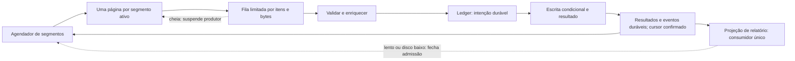

# Concorrência, backpressure e throughput sustentável

Pesquisa: 18/09/2026. **DECISÃO:** MVC + Virtual Threads + AWS SDK síncrono é a base do `aws-ops-toolkit`. Este capítulo especifica o desenho completo; o skeleton LOCAL demonstra apenas parte dele. Limites aqui são pontos iniciais de laboratório, não capacidade homologada de produção.

## Comparação dos modelos

| Modelo | Simplicidade e diagnóstico | Recursos e limites | Quando escolher |
| --- | --- | --- | --- |
| A: MVC + VT + SDK sync | Fluxo sequencial, stack trace direto, regra fácil de escrever | Threads virtuais reduzem custo de espera; semáforos, conexões, filas e taxa continuam limitados | Padrão para operações locais dominadas por I/O |
| B: MVC + VT + SDK async | Dois modelos de execução; `join()` indiscriminado acrescenta complexidade | Útil quando o adapter possui pipeline async próprio; não bloquear event loop | Transferências específicas ou benchmark que mostre ganho material |
| C: WebFlux + SDK async | Composição e cancelamento exigem experiência Reactor | Demanda reativa pode limitar fluxo, mas `flatMap`/prefetch e filas também precisam de limites | Equipe já reativa e workload medido que justifique |
| D: híbrido por adapter | Mantém domínio simples; fronteiras documentadas | MVC/sync para regra e async para transferência especializada | Evolução seletiva, nunca dois stacks inteiros por prevenção |

**FATO:** Virtual Threads favorecem tarefas esperando I/O, não tornam cálculos mais rápidos e não devem ser agrupadas em pools para controlar downstream. A documentação recomenda semáforos para esse controle. **DECISÃO:** adotar VT por clareza e compatibilidade com o modelo síncrono; ganho de throughput é hipótese a medir. [Oracle: Virtual Threads no Java 25](https://docs.oracle.com/en/java/javase/25/core/virtual-threads.html).

## Três limites independentes

1. **Admissão global:** número de jobs simultâneos e quantidade de itens aceitos pela engine. Adquirir permissão **antes** de criar/submeter a tarefa; um semáforo dentro de milhões de tarefas já criadas não limita heap.
2. **Concorrência por destino:** chamadas simultâneas por tabela, API, fila ou classe de recurso. O limite real é o menor entre permissões, conexões disponíveis e política operacional.
3. **Taxa:** requests/s, itens/s ou orçamento de capacidade por recurso, incluindo tentativas. Poucas chamadas simultâneas muito rápidas ainda podem exceder a taxa permitida.

Ordem padronizada: cancelamento → admissão → permissão downstream → permissão de taxa próxima ao envio → chamada com deadline → liberação `finally`. Não retirar milhares de tokens para tarefas que ficarão esperando conexão: isso pode concentrar envios posteriores em burst. O período esperando a taxa ocupa uma vaga limitada de admissão, sem criar novas tarefas. Nunca manter permissão DynamoDB enquanto espera HTTP/SNS. Evitar adquirir múltiplos semáforos em ordens diferentes. Se um estágio precisar reservar vários recursos, usar ordem global e deadline único. Tempo esperando permissões integra o deadline do item.

**Limite de implementação:** um limiter em volta de `client.scan()` mede chamadas lógicas, não automaticamente cada tentativa interna do SDK. Para um teto estrito de requests físicos, implementar um ponto de controle por tentativa compatível com o transporte e validá-lo em HML, ou reservar conservadoramente o máximo de tentativas por chamada. Medir tentativas reais e reduzir admissão pela amplificação observada. Não anunciar requests/s estritamente limitado se somente chamadas lógicas foram controladas. [AWS SDK: métricas de chamadas/tentativas](https://docs.aws.amazon.com/sdk-for-java/latest/developer-guide/metrics.html).

## Pipeline limitado

**DECISÃO:** `BlockingQueue` limitada ou fan-out limitado por página, sem Reactor na base. O fan-out inicial pode esperar toda a página antes de avançar: menor complexidade de checkpoint, em troca de sofrer com o item mais lento. `Flow` só agrega quando adapters precisarem de um protocolo explícito de demanda. `CompletableFuture` serve para pequenas composições independentes; nunca manter uma lista de futures de todos os registros. Async com futures também exige admissão anterior à submissão e cancelamento explícito.

O ledger é a autoridade: resultados, eventos de relatório e cursor são confirmados localmente conforme [checkpoint](23-checkpoint-resume-idempotency.md); a renderização ocorre depois. A fila da projeção em heap é limitada, e seu backlog em disco também tem orçamento de bytes/idade. Se o writer não acompanhar, o supervisor fecha admissão ao atingir esse orçamento, sem perder os eventos já duráveis nem repetir efeitos para reconstruir CSV.

Um limite em número de objetos sozinho é insuficiente. Planejar:

`heap vivo aproximado = páginas ativas × bytes decodificados por página + itens em voo × bytes por contexto + fila de relatório + caches limitados + margem JVM`.

Bytes decodificados devem ser medidos: JSON, mapas e strings podem ocupar mais que payload transportado. Proibir `scanAll().stream().toList()`, coletores globais e mapas com todos os IDs. O ledger em disco guarda histórico; heap contém apenas janela de trabalho. Streams sequenciais são aceitáveis para páginas pequenas; loops tornam mais claro o hot path com early exit/cancelamento. Escolher após profiling, sem presumir ganho de microssegundos relevante para chamadas remotas.

## Configuração inicial proposta

| Controle | Valor inicial de laboratório | Unidade/faixa configurável | Impacto |
| --- | --- | --- | --- |
| Jobs simultâneos | 1 | 1–4; produção homologada separadamente | Compartilha CPU, disco e quotas entre jobs |
| Segmentos lógicos Scan | 8 | 1–128 no produto, limite deliberadamente interno | Define particionamento persistido da varredura |
| Chamadas Scan simultâneas | 2 | 1 até total de segmentos e teto aprovado | Controla pressão de leitura |
| Limite de avaliação por página | 100 | 1–1.000 como faixa operacional inicial | Não é tamanho em bytes nem quantidade pós-filtro |
| Itens admitidos | 32 | 1–256 | Limita tarefas vivas na engine |
| Chamadas HTTP simultâneas | 4 | 1–32 | Independente do pool DynamoDB |
| Fila de resultados | 128 | 1–2.048, também com orçamento de bytes | Reporter lento bloqueia produtores |
| Checkpoint | Por página confirmada e pausa | Sem avançar acima dos itens confirmados | Reduz replay e preserva correção |

Esses números não substituem taxa em requests/s/RCU/WCU acordada com o dono do serviço. `Limit` de Scan é aplicado antes do filtro; uma página vazia com cursor ainda demanda continuação. [AWS: paginação e limites de Scan](https://docs.aws.amazon.com/amazondynamodb/latest/developerguide/Scan.html).

## Parallel Scan adaptativo: ADVANCED

`TotalSegments` fica **imutável durante o job e suas retomadas**. Adapta-se o número de segmentos ativos/chamadas simultâneas, mantendo cursor próprio para cada segmento. Não se recalcula o particionamento a cada redução de throughput. Todos os segmentos, inclusive inativos, permanecem no manifesto até concluídos.

**DECISÃO proposta:** controlador AIMD conservador por recurso, amostra a cada 10 s e janela móvel de 60 s. Começar com 2 permissões. Após 3 janelas saudáveis, aumentar 1, até o teto manual. Se houver throttling sustentado, 429 ou p95 acima de duas vezes a referência saudável, reduzir para `max(1, floor(atual / 2))`; manter cooldown de 60 s. Reduzir também o orçamento de taxa quando o sintoma for quota. Erro de autenticação, autorização, schema ou disco fecha admissão, independentemente do AIMD. Limiares são hipóteses a calibrar em HML, nunca fatos universais.

Para impedir oscilações: separar latência de fila da latência remota; amostra mínima antes de aumentar; não aumentar se CPU estiver saturada, fila de saída cheia, checkpoint atrasado ou error budget consumido. Limitar a soma dos jobs por recurso, não apenas cada job. Clientes SDK com retry adaptativo podem introduzir outro controlador: não habilitar dois mecanismos adaptativos sem ensaio de estabilidade. Ver [resiliência](13-resilience.md).

Em modo provisionado, o teto considera a parcela de RCU/WCU cedida ao toolkit e folga para consumidores existentes; em on-demand, ainda há orçamento interno aprovado, limites observados de conta/tabela/partição e custo. Não converter on-demand em “sem limite”. `ReturnConsumedCapacity` retroalimenta o orçamento, porque itens maiores mudam custo por request. Projetar volume/tamanho médio/p95 antes da execução; skew de chaves e segmentos deve aparecer nas métricas. A estratégia observa cada recurso e mantém progresso justo entre segmentos, sem acelerar um segmento quente à custa dos demais. Ver detalhes de capacidade e Scan em [DynamoDB](06-dynamodb.md).

## Escolha das primitivas

| Primitiva | Uso recomendado | Restrição |
| --- | --- | --- |
| `Semaphore` | Número de tarefas admitidas ou chamadas ao recurso | Aquisição com timeout/cancelamento; liberar no `finally` |
| Rate limiter | Requests por período e burst autorizado | Retry consome orçamento; RCU usa estimativa e realimentação |
| Bulkhead | Impedir que API lenta consuma todas as permissões | Separação por dependência; não duplicar semáforo equivalente |
| Executor dedicado de plataforma | Transformação pesada de CPU | Fila limitada e rejeição explícita; dimensionar perto dos cores disponíveis |
| Virtual thread por tarefa | Espera I/O síncrona | Não guardar cache pesado em `ThreadLocal` |
| `parallelStream()` | Eventual experimento CPU local e isolado | Desaconselhado na engine: pool compartilhado, cancelamento e limites obscuros |
| `ScopedValue` | Metadados imutáveis durante execução de tarefa | Rebind na nova tarefa; não presumir propagação por executor |

`ScopedValue` é estável no Java 25. Um `record` com `operationId`, `step` e alvo evita muitos bindings. Ainda assim contexto explícito no contrato é mais simples de testar e auditar. Structured Concurrency é preview no Java 25 e fica fora do runtime produtivo. [API ScopedValue](https://docs.oracle.com/en/java/javase/25/docs/api/java.base/java/lang/ScopedValue.html), [Structured Concurrency](https://docs.oracle.com/en/java/javase/25/core/structured-concurrency.html).

## Cancelamento, hot tuning e saturação

Cancelamento cooperativo fecha admissão, interrompe paginação e espera chamadas atômicas por deadline. Interrupção não prova que uma chamada remota não ocorreu. Resultados ambíguos vão para reconciliação. Pool limitado não substitui timeout: sem ele todos os slots podem ficar presos.

Hot tuning é ADVANCED: permitir reduzir concorrência/taxa e pausar pelo plano de controle autenticado. Redução não mata tarefas; novas aquisições aguardam até `inFlight < novoLimite`. Aumento exige teto pré-aprovado e evento de auditoria. Não permitir alterar conta, recurso, `TotalSegments`, regra, modo, idempotency key ou filtros de job em execução. Cada versão da política é registrada no ledger.

O ponto de operação fica antes da saturação: crescimento de concorrência sem ganho proporcional, aumento de p95, retries ou fila indica redução. Ver [benchmark](19-benchmark-plan.md); nenhum resultado de performance foi produzido por esta documentação.
