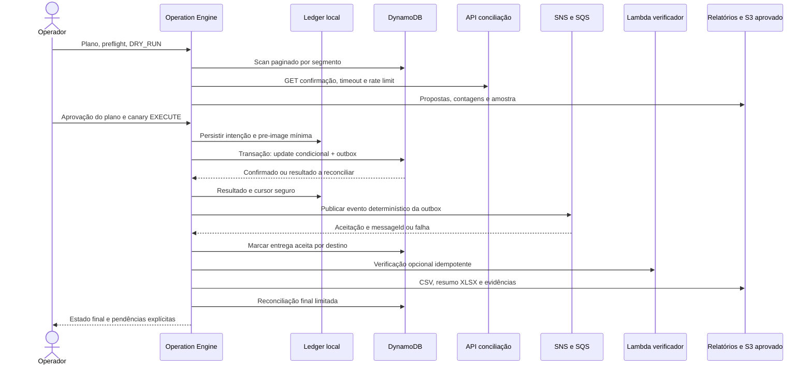

# Cenário fictício: reconciliação de pagamentos

**HIPÓTESE de desenho, não execução realizada.** Todos os nomes, volumes e identificadores a seguir são sintéticos. O skeleton entregue não executa este cenário integrado nem escreve na AWS. O roteiro valida conceitualmente o toolkit completo e serve de aceitação em ambiente LOCAL/HML isolado.

## Problema e fronteira de responsabilidade

Um defeito deixou registros `SETTLEMENT_PENDING` mesmo após confirmação de liquidação por uma API de conciliação. A tabela fictícia `<payments-table>` tem 10 milhões de registros; estimam-se 500 mil candidatos em uma janela temporal fechada. O objetivo é corrigir o estado operacional e emitir notificação de reconciliação, **sem cobrar novamente, alterar valor ou gerar nova liquidação financeira**.

Campos mínimos: `paymentId` sintético, `createdAt`, `status`, `version`, `settlementReference`, `updatedAt`. A regra versão `payment-state-repair/v1` aceita apenas a janela do incidente, estado pendente, referência válida e confirmação correspondente da API. Resposta ausente, divergente ou schema inesperado não autoriza escrita. PII e dados completos do pagador ficam fora da projeção.

A equipe avalia primeiro Query/GSI/export aprovado. Para este exercício assume-se que não há índice que atenda à seleção; Scan excepcional é aprovado com orçamento de leitura. ConsistentRead por item não torna a varredura snapshot, então a validação antes da escrita e a reconciliação posterior permanecem obrigatórias. [AWS: contrato Scan](https://docs.aws.amazon.com/amazondynamodb/latest/APIReference/API_Scan.html).

## Planejamento e estimativa

Preflight confirma provider, STS, conta `<ACCOUNT_ID>`, região `<REGION>`, tabelas, tópico, fila, alias Lambda e bucket em allowlists. DRY_RUN compartilha seleção, enriquecimento e transformação com EXECUTE, mas substitui side effects por intenções. Produz volume localizado/candidato/ignorado, proposta before/after, recursos, consumo observado, estimativa de requests, espaço e riscos.

Exemplo de estimativa, não medição: com 100 itens avaliados por página, 10 milhões implicariam pelo menos cerca de 100 mil páginas se o limite de bytes não as reduzisse. Cada candidato adiciona no máximo uma consulta HTTP lógica antes de retries; cache limitado só é permitido quando sua validade é definida. Correção com outbox usa uma transação por item; publicação e verificação têm orçamentos separados. Scan real pode ter páginas menores e mudança concorrente; não transformar esta conta em previsão exata de custo/duração.

O plano fixa seleção, transformação, recursos e `TotalSegments=8`, começando com 2 chamadas Scan ativas e limites próprios HTTP/escrita. Aprovação é vinculada ao plano, incidente, hash da regra e expiração. Antes da massa, canary de 10, 100 e, se autorizado, 1.000 itens, validado pelo dono do domínio.

## Fluxo e fronteira transacional

**DECISÃO para este cenário:** se a consistência entre correção e evento for requisito, usar outbox DynamoDB **pré-existente e aprovada** na mesma conta/região. `TransactWriteItems` combina update condicional do pagamento e criação do evento com chave determinística. A ferramenta não cria tabela, stream, role ou infraestrutura durante o incidente sem escopo próprio. A ideia de outbox deriva do padrão de tratamento de dual write; consumidores continuam idempotentes. [AWS Prescriptive Guidance: transactional outbox](https://docs.aws.amazon.com/prescriptive-guidance/latest/cloud-design-patterns/transactional-outbox.html).

A condição verifica estado esperado, versão observada e ausência de correção anterior; update mínimo muda estado, incrementa versão e registra marcador autorizado. O `ConditionExpression` pertence ao próprio Update: não adicionar ConditionCheck separado para o mesmo item na transação. `eventId` deriva de operação lógica, item e versão da regra; permanece estável nas retomadas. `ClientRequestToken` auxilia em janela curta, mas não resolve retomada horas depois. [AWS: transações e janela de idempotência](https://docs.aws.amazon.com/amazondynamodb/latest/developerguide/transaction-apis.html).

Sem outbox/CDC aprovada ou possibilidade de verificar marcador persistente, a operação não pode prometer atomicidade update+evento. Alternativa explícita: ledger de etapas com reconciliação e consumidores deduplicando permanentemente pelo eventId; risco residual de disco perdido/resultado não verificável precisa ser aceito no plano. Se o requisito exige ausência desse risco, **bloquear EXECUTE até existir mecanismo adequado**.

SNS é o canal normal de notificação. SQS opcional só recebe um comando independente de verificação; não duplicar um mesmo efeito já entregue por assinatura SNS→SQS. Lambda usa alias fixo e serve para inspeção/verificação, com chave de idempotência se causar efeitos. Upload S3 sucede finalização do artefato e depende de allowlist/encriptação autorizada. CSV guarda detalhe; XLSX agrega status e amostras.

## Falhas injetadas e resposta esperada

| Injeção de HML | Reação e estado durável | Critério de aceitação |
| --- | --- | --- |
| Throttling DynamoDB | SDK faz retry limitado; controlador reduz pressão e pausa se persistente | Sem multiplicação de retries, sem cursor saltando página incompleta |
| HTTP 429 com `Retry-After` | Classificar rate limit; respeitar espera dentro de deadline, reduzir taxa | Fila limitada e cancelável, chamada não monopoliza todos os slots |
| HTTP 500 sustentado | Retry limitado do GET; circuit breaker/budget pausa enriquecimento | Nenhum item sem confirmação recebe update |
| Timeout após request de escrita | Intenção vira resultado desconhecido; ler marcador/outbox antes de repetir | Nenhuma atualização/evento repetido cegamente |
| Item alterado por sistema concorrente | Condição falha; reavaliar uma vez conforme política ou registrar conflito | Versão nova preservada, sem overwrite |
| Credencial expira a 48% | Fechar admissão AWS, drenar com deadline, `AUTHENTICATION_REQUIRED` | Checkpoints por segmento persistem somente desfechos confirmados |
| SQS entrega duplicada | Consumidor verifica eventId e resultado já aplicado | Nenhum efeito de negócio duplicado |
| SNS falha após update confirmado | Outbox mantém evento pendente; não repetir update | Retomada trabalha somente nas entregas pendentes |
| SNS aceitou e resposta se perdeu | Nova entrega pode ocorrer; dedupe no consumidor | Reconhecer at-least-once, sem alegar exactly-once de negócio |
| Operador cancela no meio da página | Parar fontes, drenar chamadas, checkpoint conservador, relatório parcial | Sem novas chamadas após barreira de cancelamento; em voo reconciliáveis |

SQS Standard admite redelivery; o ID da mensagem não substitui idempotência de negócio. [AWS: entrega ao menos uma vez](https://docs.aws.amazon.com/AWSSimpleQueueService/latest/SQSDeveloperGuide/standard-queues-at-least-once-delivery.html).

A sequência de ensaio cobre todas as falhas: executar canary saudável; massa com throttles e 429/500; provocar timeout de resposta e conflito; expirar credencial no marcador sintético de 48%; reautenticar e retomar; cancelar mais adiante; iniciar continuação autorizada que reconcilia itens em voo e entrega outbox pendente; terminar com mensagens duplicadas e falha parcial conhecida. O percentual de 48% é controlado pelo dataset de teste, não estimativa exata de Scan produtivo.

## Reconciliação e encerramento

Manter conjuntos lógicos exclusivos: `scanned = matched + notMatched` apenas quando cada leitura física é contabilizada coerentemente; replay e leituras repetidas têm contador separado. Para candidatos únicos do ledger: `candidates = corrected + alreadyCorrect + conflicts + rejected + failed + unresolved + pending`. Eventos aceitos pelo broker são distintos de eventos consumidos com sucesso. Não somar métricas de tentativas como se fossem itens únicos.

Reconsultar todos os resultados desconhecidos e amostra/todos os corrigidos conforme criticidade; validar versão, estado, marcador e referência. Cruzar outbox por destino, acknowledgements e, se disponível, confirmação do consumidor. Comparar totais e valores monetários agregados como invariantes de que nenhuma cobrança foi criada/alterada; o owner define critérios financeiros, a ferramenta não os inventa.

`COMPLETED` requer zero pendência não aceita e critérios da operação satisfeitos; falhas contabilizadas resultam em `COMPLETED_WITH_ERRORS` ou estado específico aprovado pela engine. Cancelamento nunca vira completo por ter CSV. O dossiê final inclui manifestos, tempos, build/regra, confirmações, counters, conflitos, unknowns, canary, retomadas e próximos responsáveis. Nenhum volume ou tempo deste capítulo é resultado de benchmark realizado.
