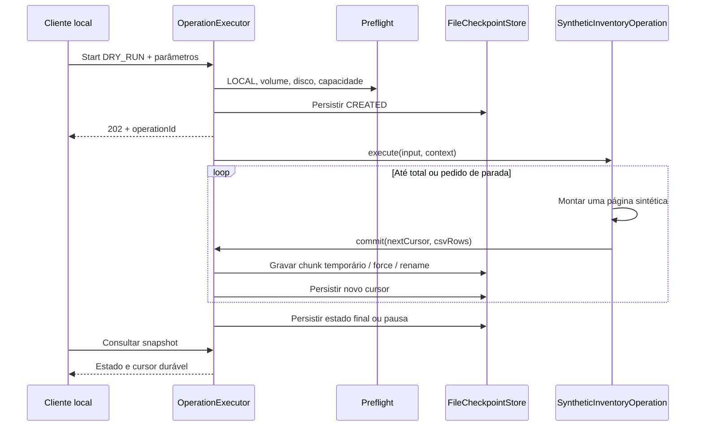

# Blueprint de implementação

Este documento descreve o código em `src/main/java/io/github/awsopstoolkit` e sua evolução planejada. **Real** significa presente no repositório; **exemplo** significa compilável, mas sem operação REST conectada; **alvo** significa requisito/documentação ainda não implementado.

## Matriz de escopo

| Capacidade | Situação | Limitação |
|---|---|---|
| Inicialização Java 25/Boot e configuração validada | Real | JDK e baseline corporativa precisam ser homologados |
| API local + bearer token | Real | Token obrigatório fornecido pelo operador; sem gerador automático no servidor |
| Operação `synthetic-inventory` | Real | Somente LOCAL/DRY_RUN; nenhum dado AWS |
| Execução assíncrona, estado, pausa/cancelamento e retomada | Real | Estado demonstrativo menor que a máquina alvo |
| Checkpoint JSON e CSV em chunks | Real | Replay determinístico local; sem ledger de efeitos remotos |
| Clients AWS por profile explícito e Apache 5 | Exemplo opcional | Beans criados somente se AWS habilitada; não há operação AWS registrada |
| Validação STS de account | Exemplo opcional | Não verifica role/allowlist de recurso nem concede permissão |
| DynamoDB/SQS/SNS/Lambda/S3 | Exemplos | Sem binding automático à engine; políticas da operação permanecem necessárias |
| HTTP Interface + RestClient | Exemplo | Construção explícita; sem endpoint externo chamado pela demo |
| Autorização produtiva, plano, canary e auth resume | Alvo | EXECUTE indisponível |
| SQLite/WAL, ledger, outbox/reconciliação | Alvo | JSON atual não tem essas garantias |
| XLSX, exportação S3, observabilidade completa | Alvo | CSV/medição local não são audit trail produtivo completo |

## Pacotes e arquivos reais

```text
io.github.awsopstoolkit/
  AwsOpsToolkitApplication.java
  api/
    OperationController.java
    ApiExceptionHandler.java
  configuration/
    ToolkitProperties.java
    LocalSecurityConfiguration.java
    AwsClientConfiguration.java
  operation/
    OperationDefinition.java
    OperationRegistry.java
    OperationExecutor.java
    OperationContext.java
    OperationRequest.java
    OperationSnapshot.java
    OperationMode.java
    OperationStatus.java
    PreflightCheckService.java
    SyntheticInventoryOperation.java
  checkpoint/
    FileCheckpointStore.java
  report/
    Csv.java
  authentication/
    AwsCredentialHealthService.java
  aws/
    AwsCallGate.java
    WriteAuthorization.java
    DynamoDbService.java
    DynamoDocument.java
    SqsService.java
    SnsService.java
    LambdaService.java
    S3Service.java
  integration/
    PaymentLookup.java
    HttpIntegrationClient.java
    IntegrationException.java
```

Pacotes por capacidade mantêm arquivos próximos de sua responsabilidade. Subpacotes `core/api/adapter` poderão surgir quando houver implementação suficiente; criar módulos Maven separados agora acrescentaria manutenção sem fronteiras de release distintas. A árvore alvo mais extensa está na [arquitetura](02-architecture.md).

## Matriz de responsabilidades do código atual

| Classe/contrato | Responsabilidade | Dependências e restrições |
|---|---|---|
| `AwsOpsToolkitApplication` | Bootstrap e descoberta de properties | Spring Boot |
| `OperationController` | Traduz HTTP em comandos e devolve snapshots/CSV streaming | Executor e store; não acessa AWS |
| `ApiExceptionHandler` | Mapeia validação, conflito, ausência e I/O a erros sanitizados | Não inclui mensagem upstream ou stacktrace |
| `ToolkitProperties` | Ambiente, disco, admissão, token e config AWS tipados | Bean Validation; `toString` redigido |
| `LocalSecurityConfiguration` | Bearer stateless, rejeição de Origin e proteção dos endpoints | Token não aparece em URL/log; loopback vem do YAML |
| `AwsClientConfiguration` | Provider, transporte e clients reutilizados com lifecycle | Opcional; perfil e conta esperada explícitos |
| `OperationDefinition<I>` | Tipo/versão e entrada tipada, total, execução | Sem contrato genérico de efeitos produtivos nesta fase |
| `OperationRegistry` | Associa tipo a implementação | Duplicatas e tipo desconhecido falham |
| `OperationExecutor` | Admissão, execução, transições, checkpoints e recuperação | Um controle ativo por ID; número de jobs limitado |
| `OperationContext` | ID, cursor, page size, sinal de parada e commit | `ScopedValue` guarda só correlação; não tem credenciais |
| `OperationRequest` | Modo e parâmetros JSON | Parâmetros convertidos ao tipo da definição |
| `OperationSnapshot` | Estado persistido, progresso e versão da definição | Resposta da API e fonte de recuperação local |
| `OperationStatus` | Estados e predicados active/resumable | PAUSED e INTERRUPTED são retomáveis |
| `PreflightCheckService` | Bloqueia EXECUTE/ambiente remoto, limita volume e disco | Falha no startup se escrita for habilitada |
| `SyntheticInventoryOperation` | Gera candidatos/ignorados determinísticos em páginas | Apenas dados `synthetic-*`; memória por página |
| `FileCheckpointStore` | Lock de diretório, snapshots/chunks atômicos, CSV | Sem transação entre arquivos e AWS |
| `Csv` | Escaping e mitigação de fórmulas comuns | Schema fixo e limitações documentadas |
| `AwsCredentialHealthService` | Consulta STS e classifica saúde básica | Retorna conta/ARN efetivos internamente, sem secrets/tokens; masking de evidências pertence ao alvo |
| `AwsCallGate` | Limita simultaneidade e início de chamadas lógicas | Retries físicos permanecem na política do client |
| `WriteAuthorization` | Porta obrigatória antes de efeitos remotos | Nenhuma implementação permissiva fornecida |
| `DynamoDbService` | Get/BatchGet/Query/scan paralelo e mutações com guard | Callbacks confirmam página antes do checkpoint |
| `DynamoDocument` | Conversões tipadas de atributos | Preserva número decimal; não é antiga Document API v1 |
| `SqsService` | Attributes, receive explícito, send/delete/visibility e batches | Receive tem impacto; nada é apagado automaticamente |
| `SnsService` | Publish/batch exclusivamente em topic explícito | Retorna falhas por entrada |
| `LambdaService` | Invocação e classificação transporte/function error | ACCEPTED não significa negócio concluído |
| `S3Service` | Head/list page/download/upload/delete | Download limitado e streaming; multipart fica no alvo |
| `PaymentLookup` | Contrato `@GetExchange` de enriquecimento | DTO pequeno e correlation ID |
| `HttpIntegrationClient` | HTTPS/host permitido, timeouts e erro sanitizado | Sem retry automático; caller fecha transporte |
| `IntegrationException` | Categorias estáveis de erro HTTP | Não carrega body ou token |

## Caminho real de uma página



Chunk gravado sem cursor confirmado é órfão; o replay determinístico substitui-o no mesmo offset. Download usa apenas chunks cobertos pelo cursor do snapshot obtido. `ATOMIC_MOVE` não é atomicidade multi-arquivo, e esta técnica não pode ser reutilizada como ledger de escrita remota. Ver [checkpoint](23-checkpoint-resume-idempotency.md).

## Adicionar uma regra local compilável

Exemplo para novo arquivo `src/main/java/io/github/awsopstoolkit/operation/SyntheticParityOperation.java`. Ele reutiliza o schema demonstrativo `recordId,decision` do relatório e o contrato paginado atual; não adiciona AWS.

```java
package io.github.awsopstoolkit.operation;

import io.github.awsopstoolkit.report.Csv;
import jakarta.validation.constraints.Max;
import jakarta.validation.constraints.Min;
import org.springframework.stereotype.Component;

@Component
public final class SyntheticParityOperation
        implements OperationDefinition<SyntheticParityOperation.Input> {

    public record Input(@Min(1) @Max(10_000_000) long records) {}

    @Override
    public String type() {
        return "synthetic-parity";
    }

    @Override
    public String version() {
        return "1";
    }

    @Override
    public Class<Input> inputType() {
        return Input.class;
    }

    @Override
    public long total(Input input) {
        return input.records();
    }

    @Override
    public void execute(Input input, OperationContext context) throws Exception {
        long cursor = context.startCursor();
        while (cursor < input.records() && !context.stopRequested().getAsBoolean()) {
            long end = Math.min(cursor + context.pageSize(), input.records());
            var rows = new StringBuilder(context.pageSize() * 40);
            for (long item = cursor; item < end; item++) {
                rows.append(Csv.cell("parity-" + item))
                        .append(',')
                        .append(Csv.cell(item % 2 == 0 ? "CANDIDATE" : "SKIPPED"))
                        .append("\r\n");
            }
            context.commit().accept(end, rows.toString());
            cursor = end;
        }
    }
}
```

O registry encontra o bean automaticamente. Iniciar com `POST /api/v1/operations/synthetic-parity` e body `{"mode":"DRY_RUN","parameters":{"records":1000}}`. Incrementar `version()` quando seleção, transformação ou schema do resultado mudar; não retomar chunks de uma definição incompatível. Alteração de versão exige novo job.

O commit espera exatamente `min(cursor + pageSize, total)` e o relatório atual tem duas colunas fixas. Uma operação de outra natureza precisa evoluir esses contratos deliberadamente; não contornar a verificação de cursor nem produzir relatório com header incompatível. Evitar listas globais, threads próprias, sleeps de retry e providers dentro da regra.

## Evolução para operação AWS

Uma regra real não pode simplesmente substituir a geração sintética por uma mutação no callback. A sequência de evolução é: integrar identidade e allowlist à engine, introduzir plano/versão e classificação de efeitos, adotar ledger por etapa, implementar idempotência/reconciliação e validar a política antes de conectar adapters de escrita. API EXECUTE continua rejeitada enquanto essas etapas estiverem pendentes.

Interfaces de relatório/cursor por serviço permitirão varreduras com contagem desconhecida e `LastEvaluatedKey`; `long cursor` da demo não representa esse cursor AWS. `total()` exato é conveniência da fonte sintética, não uma promessa de contar tabela mutável antecipadamente. Os [contratos alvo](05-operation-engine.md) e o [roadmap](20-implementation-roadmap.md) detalham a migração.

## Validação proporcional

Build/format/compilação, testes pequenos de segurança/retomada e smoke sintético são a base. Uma regra local adicional deve provar determinismo por versão, paginação, cancelamento e ausência de duplicação no relatório. Adapter AWS exige validação isolada/DEV/HML; não usar produção como laboratório. O checklist registra evidências efetivas, não inferidas da existência dos exemplos.
