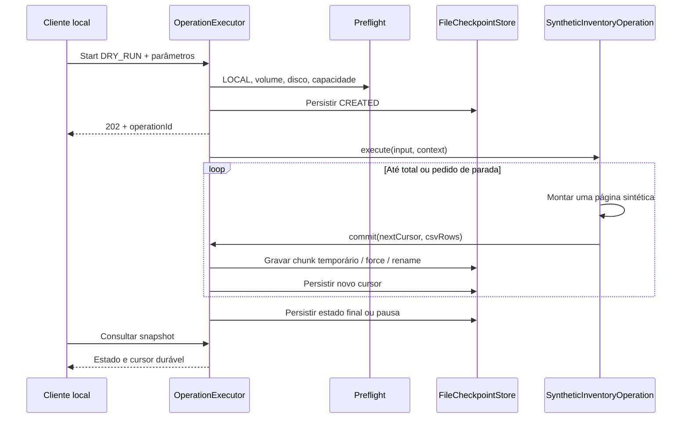

# Blueprint de implementação

Este documento descreve o código em `src/main/java/io/github/awsopstoolkit` e sua evolução planejada. **Real** significa presente no repositório; **exemplo** significa compilável, mas sem operação REST conectada; **alvo** significa requisito/documentação ainda não implementado.

## Matriz de escopo

| Capacidade | Situação | Limitação |
|---|---|---|
| Inicialização Java 25/Boot e configuração validada | Real | JDK e baseline corporativa precisam ser homologados |
| API local + bearer token | Real | Token obrigatório fornecido pelo operador; sem gerador automático no servidor |
| Operação `synthetic-inventory` | Real | Somente LOCAL/DRY_RUN; nenhum dado AWS |
| Execução assíncrona, estado, pausa/cancelamento e retomada | Real | Estado demonstrativo menor que a máquina alvo |
| Checkpoint JSON e CSV em chunks | Real | Replay determinístico local; sem ledger de efeitos remotos |
| Clients AWS centralizados por profile/provider e Apache 5 | Real | Habilitados somente quando `toolkit.aws.enabled=true`; ambiente corporativo ainda requer homologação |
| Validação STS/account/principal/recurso | Real | Allowlist e identidade efetiva são guardrails; Break Glass/SSO corporativo permanece `VALIDAR NO AMBIENTE` |
| DynamoDB/SQS/SNS/Lambda/S3 | Real no runtime | Workflows concretos, budgets, ledger e laboratório Moto; sem alegar homologação AWS real |
| HTTP/JDK `PaymentGateway` | Real | Endpoint/host/timeouts/retry/body limit via `HttpProperties`; 429/5xx participam do backpressure |
| Autorização, DRY_RUN, plano, aprovação, canary e auth resume | Real | Writes continuam fail-closed por múltiplos gates |
| SQLite/WAL, ledger e reconciliação | Real | Durável localmente; não cria transação distribuída com AWS |
| CSV streaming/XLSX SXSSF, audit e métricas | Real | Retenção/PII/Datadog corporativos continuam dependentes do ambiente |

## Pacotes e arquivos reais

```text
io.github.awsopstoolkit/
  AwsOpsToolkitApplication.java
  api/
    OperationController.java
    ApiExceptionHandler.java
  configuration/
    ToolkitProperties.java
    LocalSecurityConfiguration.java
    AwsClientConfiguration.java
  operation/
    OperationDefinition.java
    OperationRegistry.java
    OperationExecutor.java
    OperationContext.java
    OperationRequest.java
    OperationSnapshot.java
    OperationMode.java
    OperationStatus.java
    PreflightCheckService.java
    SyntheticInventoryOperation.java
  checkpoint/
    FileCheckpointStore.java
  report/
    CsvColumn.java
    CsvReportWriter.java
    CsvReportWriterFactory.java
    OperationReportRow.java
    OperationReportSchema.java
    ReportResult.java
    ReportWriter.java
  authentication/
    AwsCredentialHealthService.java
  aws/
    AwsCallGate.java
    WriteAuthorization.java
    DynamoDbService.java
    DynamoDocument.java
    SqsService.java
    SnsService.java
    LambdaService.java
    S3Service.java
  runtime/
    PaymentGateway.java
  batch/
    Batching.java
    BatchProcessor.java
  dynamodb/
    DynamoTableDescriptor.java
    DynamoTableGateway.java
    DynamoTableGatewayFactory.java
  report/
    CsvReportWriter.java
    CsvColumn.java
```

Pacotes por capacidade mantêm arquivos próximos de sua responsabilidade. Subpacotes `core/api/adapter` poderão surgir quando houver implementação suficiente; criar módulos Maven separados agora acrescentaria manutenção sem fronteiras de release distintas. A árvore alvo mais extensa está na [arquitetura](02-architecture.md).

## Matriz de responsabilidades do código atual

| Classe/contrato | Responsabilidade | Dependências e restrições |
|---|---|---|
| `AwsOpsToolkitApplication` | Bootstrap e descoberta de properties | Spring Boot |
| `OperationController` | Traduz HTTP em comandos e devolve snapshots/CSV streaming | Executor e store; não acessa AWS |
| `ApiExceptionHandler` | Mapeia validação, conflito, ausência e I/O a erros sanitizados | Não inclui mensagem upstream ou stacktrace |
| `ToolkitProperties` | Ambiente, disco, admissão, token e config AWS tipados | Bean Validation; `toString` redigido |
| `LocalSecurityConfiguration` | Bearer stateless, rejeição de Origin e proteção dos endpoints | Token não aparece em URL/log; loopback vem do YAML |
| `AwsClientConfiguration` | Provider, transporte e clients reutilizados com lifecycle | Opcional; perfil e conta esperada explícitos |
| `OperationDefinition<I>` | Tipo/versão e entrada tipada, total, execução | Sem contrato genérico de efeitos produtivos nesta fase |
| `OperationRegistry` | Associa tipo a implementação | Duplicatas e tipo desconhecido falham |
| `OperationExecutor` | Admissão, execução, transições, checkpoints e recuperação | Um controle ativo por ID; número de jobs limitado |
| `OperationContext` | ID, cursor, page size, sinal de parada e commit | `ScopedValue` guarda só correlação; não tem credenciais |
| `OperationRequest` | Modo e parâmetros JSON | Parâmetros convertidos ao tipo da definição |
| `OperationSnapshot` | Estado persistido, progresso e versão da definição | Resposta da API e fonte de recuperação local |
| `OperationStatus` | Estados e predicados active/resumable | PAUSED e INTERRUPTED são retomáveis |
| `PreflightCheckService` | Valida volume, disco e guardrails da foundation; runtime possui preflight adicional por identidade/recurso | Escrita exige múltiplos gates e não é autorizada apenas por configuração |
| `SyntheticInventoryOperation` | Gera candidatos/ignorados determinísticos em páginas | Apenas dados `synthetic-*`; memória por página |
| `FileCheckpointStore` | Lock de diretório, snapshots/chunks atômicos, CSV | Sem transação entre arquivos e AWS |
| `CsvReportWriter` | CSV streaming, escaping e mitigação de formula injection | Colunas tipadas e flush vêm da infraestrutura/configuração |
| `AwsCredentialHealthService` | Consulta STS e classifica saúde básica | Retorna conta/ARN efetivos internamente, sem secrets/tokens; masking de evidências pertence ao alvo |
| `AwsCallGate` | Limita simultaneidade e início de chamadas lógicas na foundation | Runtime usa `DispatchLimiter`; retry AWS adicional pertence a `JobContext.read`, com SDK em uma tentativa |
| `WriteAuthorization` | Porta obrigatória antes de efeitos remotos | Nenhuma implementação permissiva fornecida |
| `DynamoDbService` | Get/BatchGet/Query/scan paralelo e mutações com guard | Callbacks confirmam página antes do checkpoint |
| `DynamoDocument` | Conversões tipadas de atributos | Preserva número decimal; não é antiga Document API v1 |
| `SqsService` | Attributes, receive explícito, send/delete/visibility e batches | Receive tem impacto; nada é apagado automaticamente |
| `SnsService` | Publish/batch exclusivamente em topic explícito | Retorna falhas por entrada |
| `LambdaService` | Invocação e classificação transporte/function error | ACCEPTED não significa negócio concluído |
| `S3Service` | Head/list page/download/upload/delete | Download limitado e streaming; multipart fica no alvo |
| `PaymentGateway` | Enriquecimento HTTP read-only com allowlist, body bounded e retries classificados | Usa `HttpProperties` e o backpressure do runtime; sem stack HTTP paralelo |
| `Batching/BatchProcessor` | Chunking incremental e batches concorrentes bounded | Não materializam o dataset global; erro parcial estruturado |
| `DynamoTableDescriptor/Gateway/Factory` | Extensão tipada de tabelas recorrentes | Nome físico vem de properties; writes continuam no adapter guardado |
| `CsvReportWriter/CsvColumn` | Reporting CSV streaming reutilizável | Commons CSV, flush configurável e proteção contra formula injection |

## Caminho real de uma página



Chunk gravado sem cursor confirmado é órfão; o replay determinístico substitui-o no mesmo offset. Download usa apenas chunks cobertos pelo cursor do snapshot obtido. `ATOMIC_MOVE` não é atomicidade multi-arquivo, e esta técnica não pode ser reutilizada como ledger de escrita remota. Ver [checkpoint](23-checkpoint-resume-idempotency.md).

## Adicionar uma nova operação

A receita operacional mantida em [adding-operation.md](development/adding-operation.md) é a fonte de verdade para extensão. O runtime descobre novos beans `Workflow` via Spring; o teste `WorkflowExtensionRegistrationTest` comprova que uma implementação adicional entra no catálogo sem editar `JobCoordinator`, controller ou configuração AWS.

Uma nova operação deve concentrar-se em:

1. request/modelo específico;
2. seleção e validação da regra;
3. transformação/efeito usando os adapters existentes;
4. projection/colunas de relatório quando necessárias;
5. bean `Workflow` da operação.

O core continua responsável por DRY_RUN/EXECUTE, budgets, identidade, allowlists, concorrência, retries seguros, checkpoint/ledger, canary, reconciliação, audit e relatórios. Não criar threads próprias, clientes AWS por operação, sleeps de retry, CSV manual ou novos controllers globais.

Para uma fonte DynamoDB recorrente, combinar a operação com [adding-dynamodb-table.md](development/adding-dynamodb-table.md): modelo + `TableSchema<T>` + `DynamoTableDescriptor<T>` + mapping lógico→físico em properties. Para investigação ad hoc, manter o acesso Document/AttributeValue existente em vez de modelar uma entidade inteira.

## Operação AWS no runtime

O runtime operacional já implementa identidade/allowlists, `DRY_RUN`/plano selado, aprovação, `EXECUTE`, ledger por efeito, canary, budgets e reconciliação. Uma regra nova não deve contornar esses contratos: ela declara recursos, seleciona candidatos e usa `JobContext.read/effect` e os adapters existentes.

DynamoDB real usa cursores/keys do SDK, paginação e segmentos quando aplicável; o `long cursor` da foundation sintética continua apenas uma demonstração local. O modo tipado `DynamoTableGateway<T>` e o modo Document/AttributeValue coexistem e compartilham client/configuração centralizados.

O que permanece fora do código não é infraestrutura básica do toolkit, e sim **homologação ambiental**: IAM/SSO/Break Glass corporativo, quotas e throttling reais, proxy/TLS/mTLS, políticas de PII/retenção e limites sustentáveis de DEV/HML. Esses pontos continuam `VALIDAR NO AMBIENTE`.

## Validação proporcional

Build/format/compilação, testes pequenos de segurança/retomada e smoke sintético são a base. Uma regra local adicional deve provar determinismo por versão, paginação, cancelamento e ausência de duplicação no relatório. Adapter AWS exige validação isolada/DEV/HML; não usar produção como laboratório. O checklist registra evidências efetivas, não inferidas da existência dos exemplos.
